# Сервис опросов NPS CES: системная документация

Документ для техлида, архитектора, разработчиков и эксплуатации. Описывает, из чего состоит система, какие процессы в ней идут, что и когда запускается, как устроены фронт и бэк, как хранятся данные и как сервис сопровождать.

Требования и принятые решения: [survey-service.md](survey-service.md). Чек-лист встраивания в инфраструктуру: [integration.md](integration.md).

Схемы нарисованы в Mermaid, GitHub показывает их прямо на странице. Процессы оформлены по правилам BPMN: дорожки по участникам, события начала и конца, шлюзы-решения.

## Содержание

1. [Назначение и границы](#1-назначение-и-границы)
2. [Компоненты и развертывание](#2-компоненты-и-развертывание)
3. [Что и когда запускается](#3-что-и-когда-запускается)
4. [Бизнес-процессы (BPMN)](#4-бизнес-процессы-bpmn)
5. [Взаимодействие по API](#5-взаимодействие-по-api)
6. [Фронт: виджет](#6-фронт-виджет)
7. [Бэк: сервис опросов](#7-бэк-сервис-опросов)
8. [Данные](#8-данные)
9. [Эксплуатация](#9-эксплуатация)
10. [Безопасность](#10-безопасность)

---

## 1. Назначение и границы

Сервис показывает клиенту на сайте короткий опрос после значимого события и сохраняет оценки. Метрики NPS и CES считаются в BI, сервис их не считает.

| Что входит | Что не входит |
|---|---|
| Поп-ап опроса на сайте (десктоп и мобильная версия) | Мобильное приложение |
| Правила показа: событие, условия, «не чаще 1 раза в день» | Промокоды и награды |
| Хранение показов, ответов и закрытий | Админка для опросов (опросы заводятся миграциями) |
| Отдача данных в DWH (зеркало БД) и пример витрины | Расчет метрик (делает BI) |
| | Пассивные опросы «Оценить сервис» |

**Опросы на старте**

| Событие | Код | Опрос | Состояние |
|---|---|---|---|
| Займ погашен | `loan_repaid` | Шаг 1: NPS 1–10, комментарий при 6 и ниже. Шаг 2: CES смайликами 1–5 про оплату, комментарий при 3 и ниже | Включен |
| Займ выдан | `loan_issued` | CES смайликами | Выключен (черновик) |
| Заявка отправлена | `application_submitted` | CES смайликами | Выключен (черновик) |
| Займ выдан, на будущее | `loan_issued` | NPS + CES | Черновик, включается миграцией |

---

## 2. Компоненты и развертывание

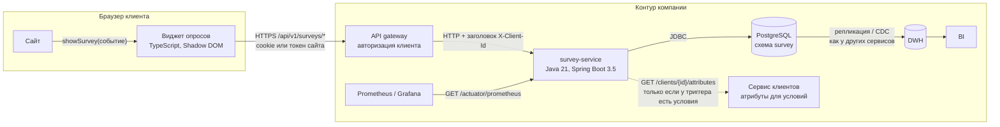

| Компонент | Технология | Где работает | Что делает |
|---|---|---|---|
| Виджет | TypeScript без зависимостей, ~5 КБ gzip | Браузер клиента, внутри страниц сайта | Спрашивает опрос, рисует поп-ап, отправляет ответы |
| API gateway | Существующий | Контур компании | Авторизует клиента, проставляет `X-Client-Id`, маршрутизирует `/api/v1/surveys/**` |
| survey-service | Java 21, Spring Boot 3.5, Docker-образ | Контур компании, 1+ экземпляров | Правила показа, хранение, API |
| PostgreSQL | 16, своя схема или БД | Существующий кластер | 5 таблиц сервиса, миграции Flyway |
| Сервис клиентов | Существующий | Контур компании | Отдает атрибуты клиента для условий показа. На старте не нужен |
| DWH и BI | Существующие | Контур компании | Зеркало таблиц, витрина, отчеты NPS и CES |
| Prometheus | Существующий | Контур компании | Собирает метрики сервиса |

**Сетевые доступы**

| Откуда | Куда | Порт | Зачем |
|---|---|---|---|
| Браузер | API gateway | 443 | Запросы виджета |
| API gateway | survey-service | 8080 | Проксирование API |
| survey-service | PostgreSQL | 5432 | Данные |
| survey-service | Сервис клиентов | по месту | Атрибуты клиента (опционально) |
| Prometheus | survey-service | 8080 | Метрики `/actuator/prometheus` |
| Оркестратор | survey-service | 8080 | Пробы `/actuator/health/liveness`, `/actuator/health/readiness` |

---

## 3. Что и когда запускается

### 3.1. Старт сервиса

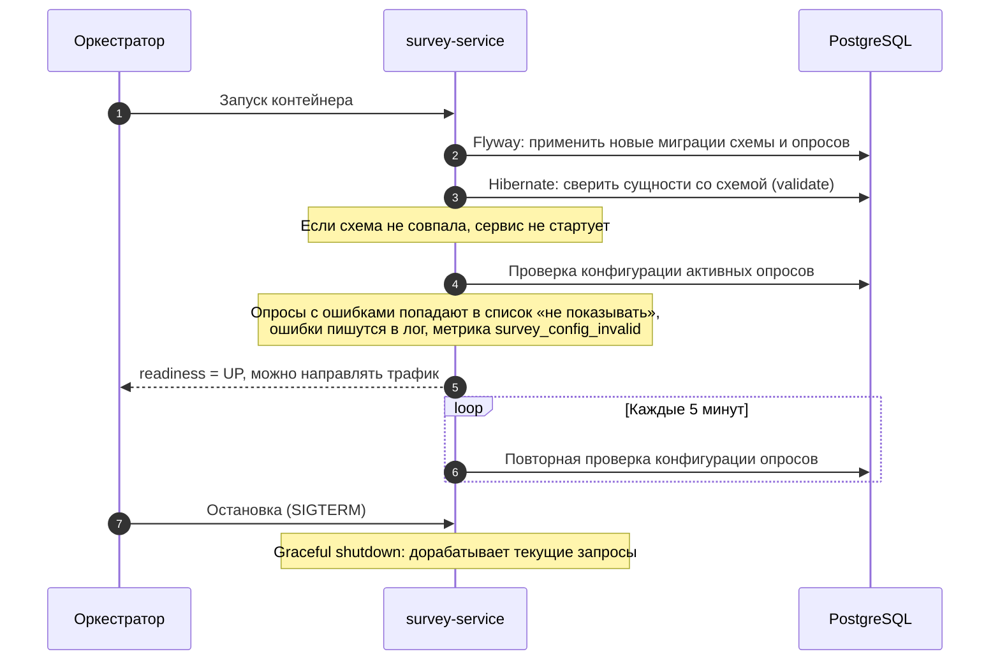

### 3.2. Расписание и триггеры

| Что | Когда запускается | Кто инициирует | Где в коде |
|---|---|---|---|
| Миграции схемы и опросов | При старте каждого экземпляра | Spring Boot (Flyway) | `backend/src/main/resources/db/migration` |
| Проверка конфигурации опросов | При старте до приема трафика, затем раз в 5 минут | Сервис | `app/SurveyConfigRegistry` |
| Запрос опроса | Через 2 секунды после события на сайте | Фронт: вызов `showSurvey` | `widget/src/index.ts` |
| Фиксация показа | Сразу после отрисовки поп-апа | Виджет | `widget/src/index.ts` |
| Сохранение ответов шага | Нажатие «Отправить» | Клиент | `widget/src/popup.ts` |
| Закрытие опроса | Крестик, Esc, клик мимо окна | Клиент | `widget/src/popup.ts` |
| Автозакрытие «Спасибо» | Через 4 секунды после последнего шага | Виджет | `widget/src/popup.ts` |
| Сбор метрик | По расписанию Prometheus | Prometheus | `/actuator/prometheus` |
| Загрузка в DWH | По расписанию DWH (ежедневно достаточно) | DWH | Механизм DWH |

Фоновых задач, которые меняют данные, в сервисе нет. Все записи создаются только по запросам виджета.

---

## 4. Бизнес-процессы (BPMN)

Обозначения: `(( ))` — событие начала или конца, `{ }` — шлюз-решение, прямоугольник — задача. Дорожки — участники процесса.

### 4.1. Основной процесс: от события до благодарности

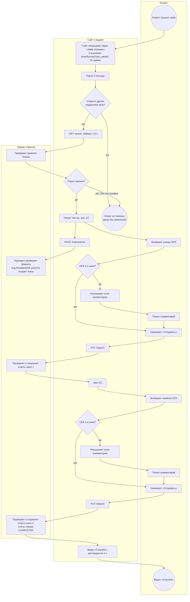

На любом шаге клиент может закрыть опрос: процесс 4.4.

### 4.2. Правила показа: решает ли сервис показать опрос

Запускается на `GET /active`. На `POST /impressions` те же проверки повторяются, кроме доли показа.

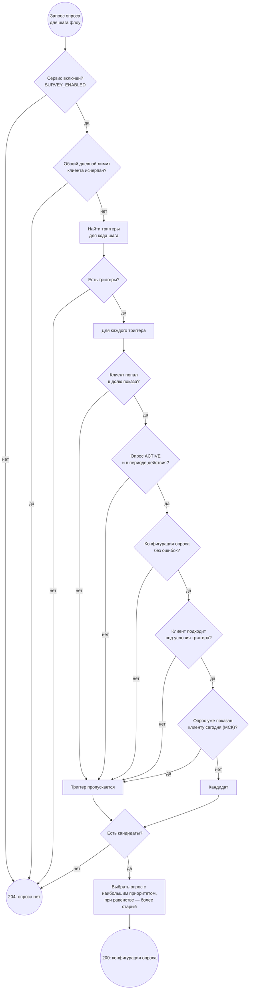

Атрибуты клиента запрашиваются у сервиса клиентов один раз за запрос и только если у какого-то триггера есть условия.

### 4.3. Сохранение ответов шага

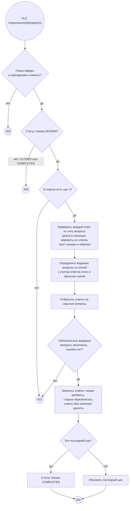

Повторная отправка того же шага перезаписывает ответы, дублей не бывает: пара «показ + вопрос» уникальна в БД.

### 4.4. Закрытие опроса

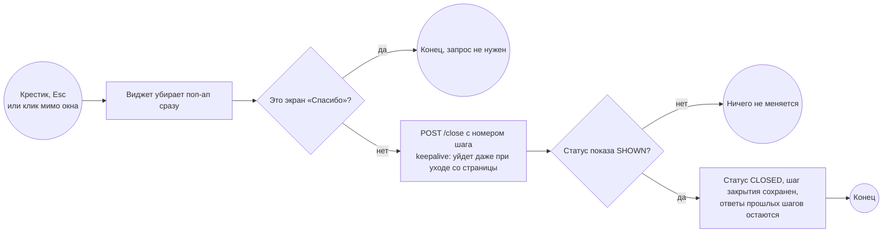

Пример: клиент ответил на NPS и закрыл опрос на шаге CES. В данных NPS — «ответил», CES — «закрыл».

### 4.5. Ошибки и деградация

| Ситуация | Что видит клиент | Что происходит |
|---|---|---|
| Сервис недоступен или ответил дольше 1,5 с | Ничего, флоу продолжается | Виджет молча не показывает опрос |
| Сервис вернул ошибку 5xx на `GET /active` | Ничего | То же |
| `POST /impressions` вернул 409 (опрос уже показан в другой вкладке) | Поп-ап исчезает | Показ не создан |
| Ошибка при отправке шага | Одна автоматическая повторная попытка, затем «Не удалось отправить, попробуйте еще раз» и кнопка снова активна | Ответы не потеряны, можно повторить |
| В конфигурации опроса ошибка | Опрос не показывается | Ошибка в логе, метрика `survey_config_invalid` > 0 |
| В опросе тип вопроса, которого не знает виджет | Опрос не показывается | Защита от опроса, заведенного раньше релиза фронта |
| Клиент обновил страницу посреди опроса | Опрос не восстанавливается | Показ остается SHOWN, ответы пройденных шагов сохранены |
| Нужно срочно выключить все опросы | Опросы пропадают | `SURVEY_ENABLED=false` и перезапуск, процесс 4.8 |

### 4.6. Данные в DWH и BI

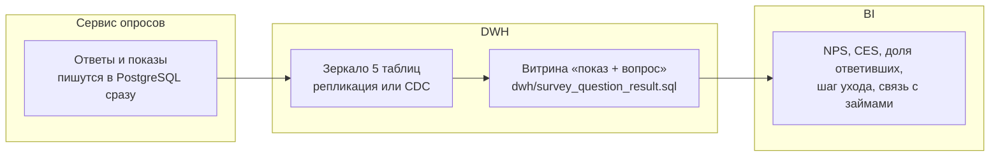

В витрине одна строка на каждый вопрос каждого показа. Результат по вопросу: `ANSWERED`, `CLOSED`, `NOT_REACHED`. Для NPS 1–10: промоутеры 9–10, критики 1–6.

### 4.7. Как завести или изменить опрос

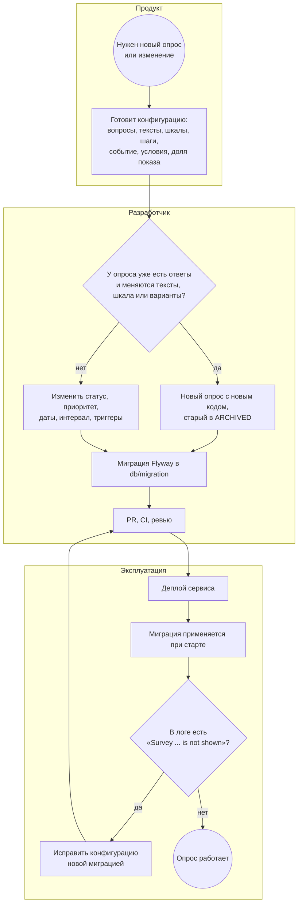

Тексты, типы, шкалы и варианты у вопроса с ответами защищены триггером в БД: такая миграция упадет.

### 4.8. Аварийное отключение

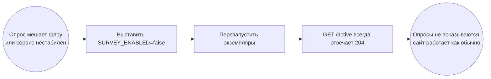

Для выключения одного опроса достаточно перевести его в `ARCHIVED` миграцией. Есть и самый быстрый вариант: убрать маршрут `/api/v1/surveys/**` на gateway, тогда виджет получит ошибку и ничего не покажет.

---

## 5. Взаимодействие по API

### 5.1. Полный сценарий

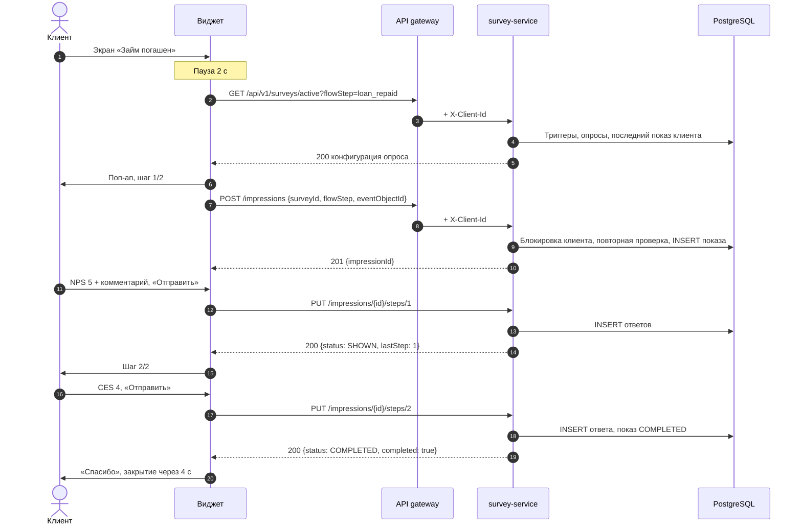

### 5.2. Операции

| Операция | Запрос | Ответы |
|---|---|---|
| Получить опрос | `GET /api/v1/surveys/active?flowStep=…` | `200` конфигурация, `204` опроса нет |
| Зафиксировать показ | `POST /api/v1/surveys/impressions` `{surveyId, flowStep, eventObjectId?}` | `201 {impressionId}`, `409 NOT_ELIGIBLE` |
| Сохранить шаг | `PUT /api/v1/surveys/impressions/{id}/steps/{n}` `{answers: [{questionId, value}]}` | `200 {status, lastStep, completed}`, `404`, `409 IMPRESSION_FINISHED`, `422 INVALID_ANSWERS` |
| Закрыть опрос | `POST /api/v1/surveys/impressions/{id}/close` `{step}` | `204`, `404` |

Общие ответы: `401` без `X-Client-Id`, `429` при превышении лимита запросов, `400` при некорректном запросе. Полное описание с примерами — Swagger UI сервиса: `/swagger-ui.html`.

---

## 6. Фронт: виджет

### 6.1. Устройство

| Модуль | Файл | Что делает |
|---|---|---|
| Точка входа | `widget/src/index.ts` | `initSurveys`, `showSurvey`, `resetSurveyVisit`; задержка, таймаут, защита от повторного вызова, проверка других модальных окон |
| HTTP-клиент | `widget/src/api.ts` | 4 операции API, `credentials: include`, `keepalive` для закрытия |
| Поп-ап | `widget/src/popup.ts` | Шаги, индикатор «1/2», условный показ вопросов, отправка с повтором, экран «Спасибо», закрытие |
| Вопросы | `widget/src/questions.ts` | Компоненты: шкала с цифрами, шкала смайликами, текст, выбор одного и нескольких, звезды |
| Стили | `widget/src/styles.ts` | Стили по макету Figma, нижняя шторка на мобильных |

Поп-ап рисуется в Shadow DOM: стили сайта и виджета не влияют друг на друга. Шрифты берутся с сайта: Mazzard M для текстов, Montserrat для цифр.

### 6.2. Состояния поп-апа

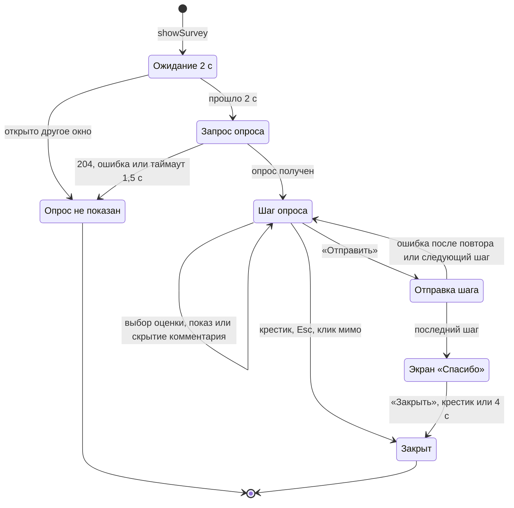

### 6.3. Подключение на сайте

```js
import { initSurveys, showSurvey } from 'survey-widget';

initSurveys({ baseUrl: '/api/v1/surveys' });

// на экране «Займ погашен», после загрузки основного контента
showSurvey('loan_repaid', { eventObjectId: loan.id });
```

| Настройка | По умолчанию | Назначение |
|---|---|---|
| `delayMs` | 2000 | Пауза перед запросом опроса |
| `requestTimeoutMs` | 1500 | Таймаут запроса опроса |
| `thankYouAutoCloseMs` | 4000 | Автозакрытие экрана «Спасибо» |
| `closeOnEsc`, `closeOnOutsideClick` | true | Закрытие по Esc и клику мимо окна |
| `isOtherModalOpen` | ищет `[aria-modal="true"]`, `dialog[open]` | Не показывать поверх других окон |
| `headers` | — | Свои заголовки, если авторизация не на cookie |

Правила встраивания: не вызывать на шагах с обязательными действиями (подписание, СМС-код, оплата); один вызов на визит на шаг, повторы игнорируются; в SPA при новом визите на шаг — `resetSurveyVisit`.

### 6.4. Сборка

| Команда | Результат |
|---|---|
| `npm run build` | `dist/survey-widget.js` (ES-модуль), `dist/survey-widget.iife.js` (для `<script>`, глобальный `SurveyWidget`) |
| `npm test` | 13 тестов (Vitest + jsdom) |
| `npm run prototype` | `nps-ces-prototype.html` — прототип без сервера |

---

## 7. Бэк: сервис опросов

### 7.1. Устройство

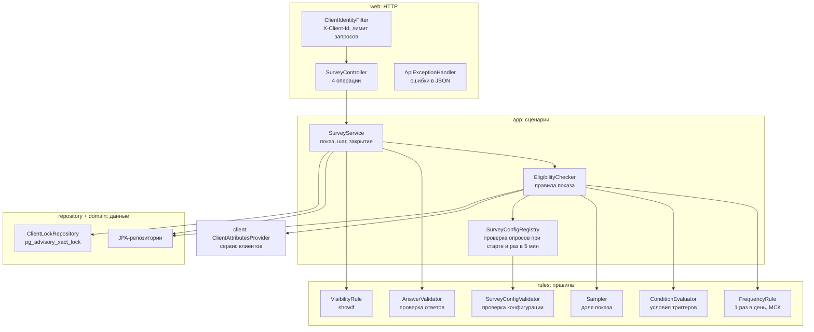

### 7.2. Транзакции и конкурентность

| Операция | Транзакция | Защита |
|---|---|---|
| `GET /active` | Только чтение | — |
| `POST /impressions` | Запись | `pg_advisory_xact_lock` по ID клиента: две вкладки не создадут два показа за день |
| `PUT /steps/{n}` | Запись | Уникальность «показ + вопрос» в БД, перезапись при повторе |
| `POST /close` | Запись | Идемпотентно: закрытый или завершенный показ не меняется |

### 7.3. Настройки

| Переменная | По умолчанию | Назначение |
|---|---|---|
| `DB_URL`, `DB_USER`, `DB_PASSWORD` | `jdbc:postgresql://localhost:5432/survey`, `survey`, `survey` | Подключение к БД |
| `PORT` | 8080 | HTTP-порт |
| `SURVEY_ENABLED` | true | Аварийный флаг |
| `SURVEY_BUSINESS_ZONE` | Europe/Moscow | Граница дня |
| `SURVEY_GLOBAL_DAILY_LIMIT` | 0 | Лимит опросов на клиента в день, 0 — нет |
| `SURVEY_CLIENT_ID_HEADER` | X-Client-Id | Заголовок с ID клиента |
| `SURVEY_RATE_LIMIT_PER_MINUTE` | 60 | Лимит запросов клиента в минуту |
| `SURVEY_CLIENT_ATTRIBUTES_URL` | пусто | Сервис клиентов для условий |
| `SURVEY_CLIENT_ATTRIBUTES_TIMEOUT_MS` | 500 | Таймаут сервиса клиентов |
| `SURVEY_CONFIG_CHECK_INTERVAL` | PT5M | Период проверки конфигурации опросов |
| `SURVEY_CORS_ALLOWED_ORIGINS` | пусто | Домены сайта, если без gateway |
| `SURVEY_API_DOCS_ENABLED` | true | Swagger UI, в проде можно выключить |
| `SPRING_PROFILES_ACTIVE` | — | `dev` добавляет примеры опросов, в проде не задавать |

---

## 8. Данные

### 8.1. Модель

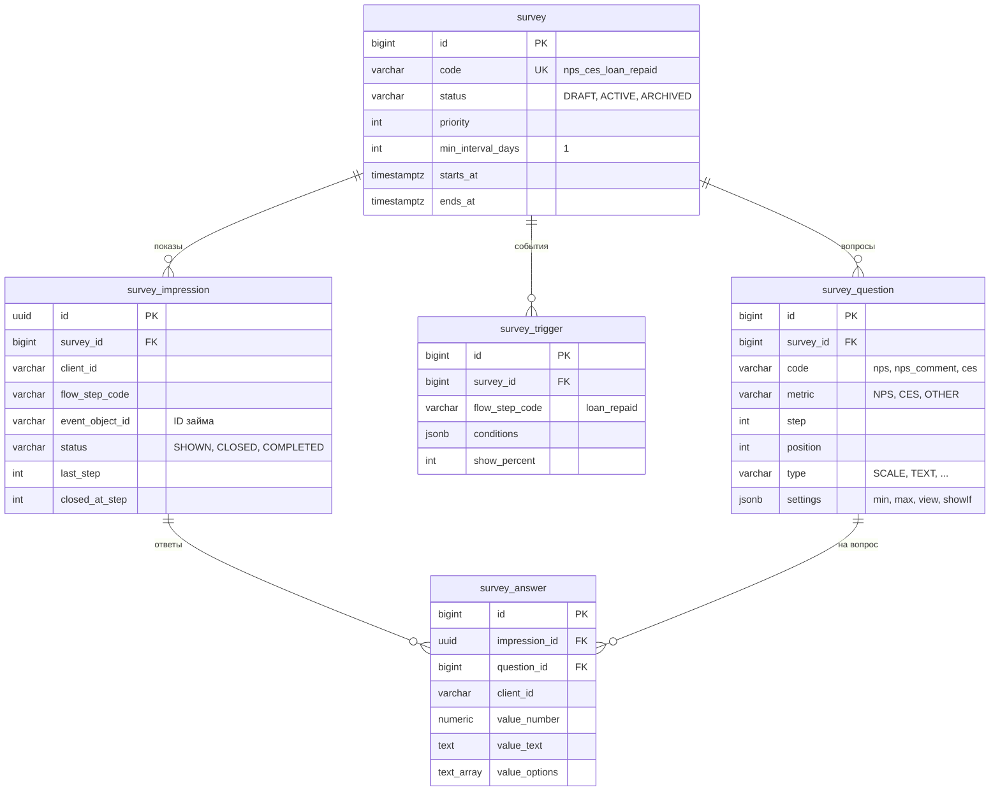

Все даты в UTC (`timestamptz`), у каждой таблицы есть `created_at` и `updated_at`.

### 8.2. Статусы показа

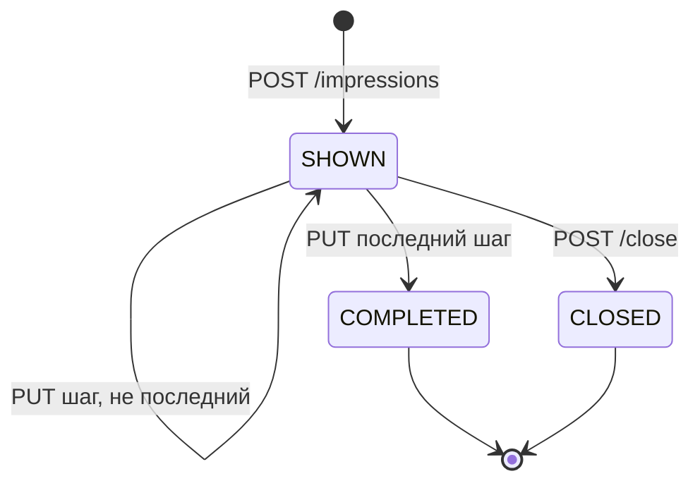

Показ в статусе SHOWN навсегда — клиент закрыл вкладку или обновил страницу. Он учитывается в правиле «1 раз в день».

### 8.3. Объемы

Строк на одно погашение с опросом: 1 показ и до 4 ответов. Размер строки ответа — сотни байт, комментарий до 1000 символов. Даже при десятках тысяч погашений в день рост — десятки мегабайт в месяц. Индексы: показы по клиенту и дате, `updated_at` у показов и ответов для инкрементальной загрузки.

---

## 9. Эксплуатация

### 9.1. Развертывание

| Шаг | Что сделать |
|---|---|
| 1 | Создать БД или схему и пользователя в PostgreSQL |
| 2 | Собрать образ: `docker build -t survey-service backend` (или через CI компании) |
| 3 | Задать переменные из п. 7.3, профиль `dev` не включать |
| 4 | Настроить пробы: liveness `/actuator/health/liveness`, readiness `/actuator/health/readiness` |
| 5 | На gateway: маршрут `/api/v1/surveys/**`, проставление `X-Client-Id`, удаление внешнего `X-Client-Id` |
| 6 | Подключить сбор метрик и алерты (п. 9.2) |
| 7 | Подключить таблицы к загрузке в DWH |
| 8 | Подключить виджет на экране «Займ погашен» |

Сервис без состояния, кроме лимита запросов в памяти: можно запускать несколько экземпляров. Миграции Flyway безопасны при одновременном старте, они берут блокировку в БД.

### 9.2. Мониторинг и алерты

| Метрика Prometheus | Что значит | Алерт |
|---|---|---|
| `http_server_requests_seconds` по `uri=/api/v1/surveys/*` | Время ответа и ошибки | p95 > 1 с или 5xx > 1% за 5 мин |
| `survey_active_requests_total{found}` | Запросы опроса и сколько раз опрос был | `found="true"` = 0 за час в рабочее время, если опрос включен |
| `survey_impressions_total{result}` | Показы: created и rejected | Резкий рост `rejected` |
| `survey_steps_answered_total` | Отправленные шаги | — |
| `survey_impressions_completed_total` | Пройденные опросы | — |
| `survey_impressions_closed_total` | Закрытые опросы | — |
| `survey_config_invalid` | Активные опросы с ошибкой конфигурации | > 0 |
| `hikaricp_connections_*` | Пул соединений с БД | Ожидание соединений > 0 долго |

В логах пишутся только ID: клиента, показа, опроса. Тексты комментариев в лог не попадают.

### 9.3. Типовые ситуации

| Симптом | Где смотреть | Что делать |
|---|---|---|
| Опрос не появляется у клиентов | `survey_active_requests_total{found}`, лог при старте | Проверить, что опрос `ACTIVE`, есть триггер на нужный код шага, нет `Survey ... is not shown` в логе, фронт вызывает `showSurvey` с правильным кодом |
| Опрос появляется у всех, кроме конкретного клиента | Таблица `survey_impression` по `client_id` | Скорее всего, ему уже показывали опрос сегодня (МСК) |
| Много 401 | Логи gateway | Gateway не проставляет `X-Client-Id` |
| Много 429 | Метрики по статусу | Фронт вызывает API в цикле, проверить встраивание |
| Много 409 на `/impressions` | `survey_impressions_total{result="rejected"}` | Две вкладки или повторные вызовы, не критично |
| Сервис не стартует | Лог старта | Ошибка миграции или схема не совпала с кодом |
| Нужно срочно выключить опросы | — | Процесс 4.8 |

### 9.4. Резервное копирование и хранение

Данные сервиса — обычные таблицы PostgreSQL, бэкап делается вместе с кластером по правилам компании. Отдельного срока хранения ответов пока нет. Если понадобится, его можно реализовать чисткой старых показов и ответов по `created_at`.

---

## 10. Безопасность

| Риск | Защита |
|---|---|
| Ответ от имени другого клиента | ID клиента берется только из заголовка gateway; gateway удаляет этот заголовок из внешних запросов; показ проверяется на принадлежность клиенту, чужой — `404` |
| Подделка значений | Сервис проверяет каждый ответ: шкала в границах, варианты из списка, длина текста |
| Вредоносный код в комментарии | Текст хранится как есть, в отчетах и интерфейсах выводится с экранированием; управляющие символы удаляются при сохранении |
| Накрутка и перегрузка | Лимит запросов на клиента, «1 раз в день» на опрос |
| Персональные данные в комментариях | Согласие при входе на сайт, данные в контуре компании; комментарии не пишутся в логи |
| Swagger UI в проде | Отключается `SURVEY_API_DOCS_ENABLED=false` |
| Порт метрик и health | Не публиковать наружу, доступ только из контура |
